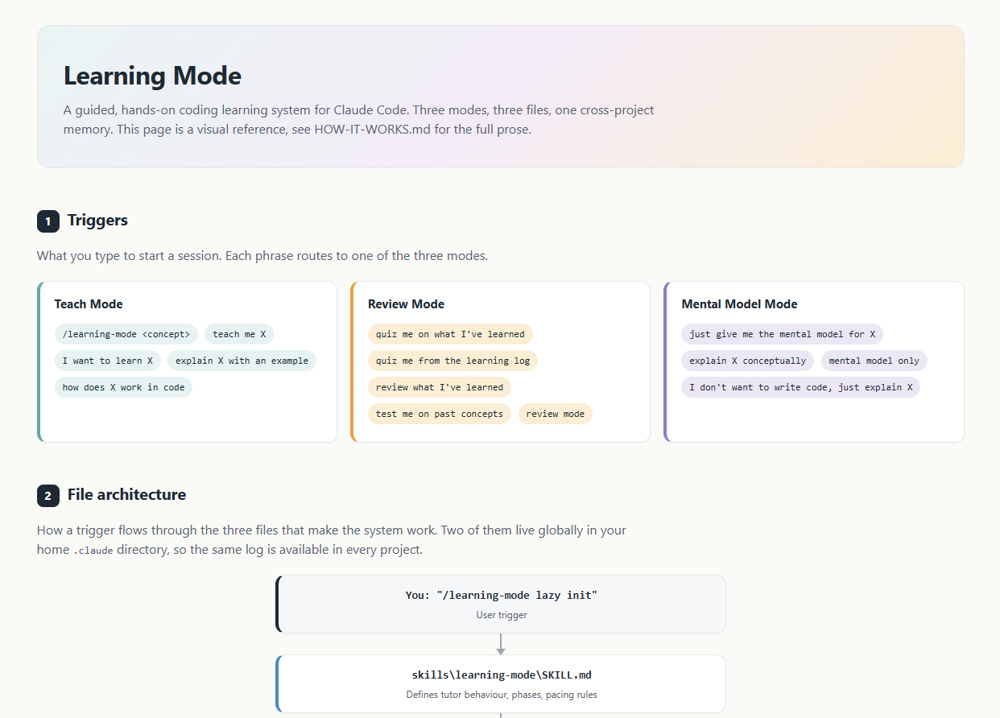

# Learning Mode

A guided, hands-on coding learning system for **Claude Code**. Pairs a custom skill with a global learning log so every concept you study is captured once and remembered across every future session, in every project.

## Three modes

| Mode | Purpose | How to trigger |
|---|---|---|
| **Teach Mode** | Learn a new concept with explanation, a runnable example, and an end-of-session integrative quiz. | "teach me X", "explain X with an example" |
| **Review Mode** | Quiz yourself on concepts from your learning log. Spaced-repetition aware. | "quiz me on what I've learned", "review mode" |
| **Mental Model Mode** | Concept-only walkthrough with analogy and diagram, no code written. | "just give me the mental model for X", "mental model only" |

## Studying for the Claude Certified Architect Exam?

There is a dedicated study guide for using Learning Mode to prepare for the exam, with a 4-week plan and a tickable topic checklist.

| File | What it gives you |
|---|---|
| **[Claude_Certified_Architect_Exam.md](Claude_Certified_Architect_Exam.md)** | The study guide: setup, daily routine, mode-selection table, and tips. |
| **[architect-exam-topics.md](architect-exam-topics.md)** | A 12-section topic checklist with suggested study sequence. Tick boxes as you go. |

If you are using this system for general learning, not the exam, skip those two files and continue below.

## Quick start

1. Copy `SKILL.md` to `C:\Users\<username>\.claude\skills\learning-mode\SKILL.md` (or `~/.claude/skills/learning-mode/SKILL.md` on macOS / Linux).
2. Copy `learning-log.md` to `C:\Users\<username>\.claude\learning-log.md` or `~/.claude/learning-log.md`, then clear the example entries.
3. Append the snippet from `global-claude-md-snippet.md` to your global `CLAUDE.md`.
4. Open any Claude Code project and try one of the trigger phrases above.

## Files in this repo

| File | Purpose |
|---|---|
| `SKILL.md` | The skill definition. Copy to your `.claude/skills/learning-mode/` directory. |
| `learning-log.md` | Starter log with a blank template entry plus two worked examples, prompt caching and tool use loop, showing the full schema. Copy to your `.claude/` directory and clear the examples before you begin. |
| `global-claude-md-snippet.md` | The block to paste into your global `CLAUDE.md`. |
| `HOW-IT-WORKS.md` | Full system design: all three mode flows, log entry schema, spaced-repetition schedule, and the file-relationship diagram. |
| `system-diagram.html` | Visual one-page diagram of the system. Triggers, file architecture flow, the three mode flows side by side, spaced-repetition schedule, and log entry shape. Open directly in a browser. |
| `Claude_Certified_Architect_Exam.md` | Study guide for using Learning Mode to prepare for the Claude Certified Architect Exam. Setup, daily routine, mode-selection table, and tips. |
| `architect-exam-topics.md` | Suggested topic checklist and 4-week study sequence for the Claude Certified Architect Exam. Optional, only relevant if you are using this system for that exam. |

## Learn more

For the full system design including mode flows, schedule logic, log schema, and setup details, see **[HOW-IT-WORKS.md](HOW-IT-WORKS.md)**. For a visual one-page overview, open **[system-diagram.html](system-diagram.html)** in a browser.

